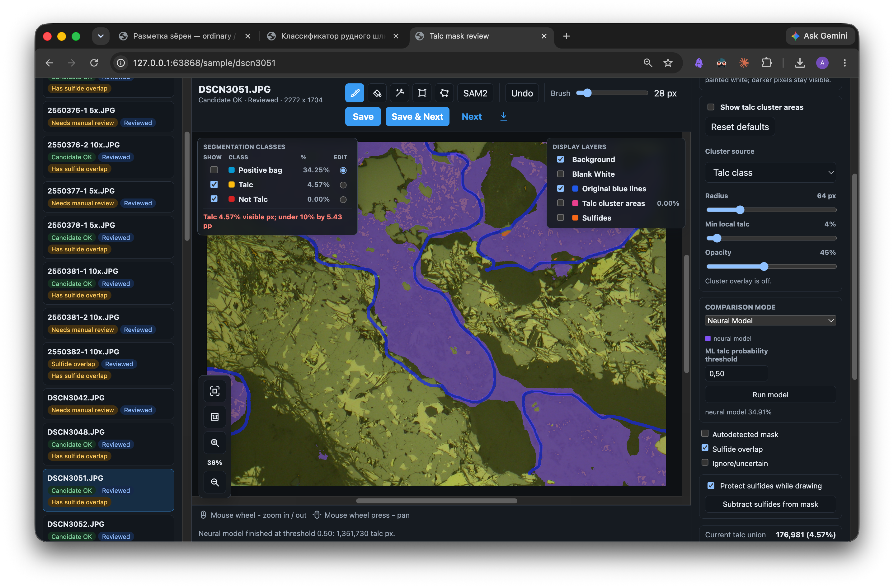
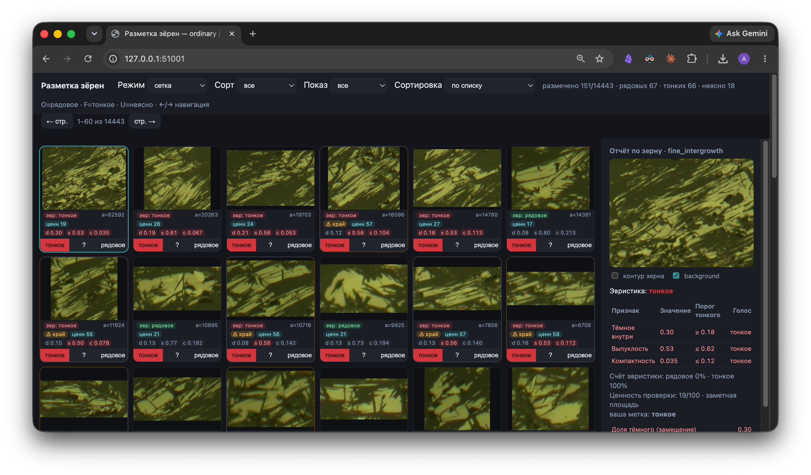

# Nornickel AI Science Hack 2026 — Скажи мне, кто твой шлиф

**Задача.** По панорамному OM-изображению полированного шлифа определить тип руды:
`рядовая` / `труднообогатимая` / `оталькованная` — с проверяемой маской, долями фаз
и текстовым заключением.

**Решение.** Интерпретируемый измерительный конвейер, а не «чёрный ящик»:
`панорама → маска талька и его доля → класс руды`. Каждый процент прослеживается до
маски, источника сигнала и параметров запуска.

**Основной проверяемый контур:** `изображение -> доля талька -> правило > 10% -> класс руды`.
Официальное правило простое и детерминированное: **`доля талька > 10%` → `оталькованная`**
(строго `>`; ровно 10% — ещё не оталькованная).

> **Чистый клон запускается сразу — нужны только `git` и `docker`.** Всё остальное
> скачивается при сборке, а **все веса моделей лежат прямо в репозитории** (Git LFS):
> `git lfs pull` — и полный ML-бэкенд готов, без ручной загрузки чекпойнтов.

> ### ✅ Сильные, проверяемые результаты
>
> **Оба официальных критерия ТЗ с измеримым порогом — закрыты и воспроизводимы:**
>
> - **Тип срастаний** (`обычное ↔ тонкое`): Grade-CNN **macro-F1 `0.930–0.939`** на
>   held-out `230` (folder-GT) — при пороге ТЗ `≥ 90%`.
> - **Производительность:** `≤ 5 мин` на `10000×10000` (100 Мп) — подтверждено на
>   трёх машинах (`99.6–186.9 с`).
>
> Итоговый фьюз-классификатор трёх классов — **macro-F1 `0.861`** без leakage.
> Все числа подписаны источником разметки (`weak-label` / `silver` / `proxy` / `folder-GT`);
> критерий «ошибка доли талька `≤ ±3%`» организаторы (QA#4) оценить не могут — эталонных
> долей талька не существует ни у кого. Полная сводка — [EVALUATION.md](EVALUATION.md).

- **Развёрнутое решение (ничего ставить не нужно):** <https://nornickel-ai-hackathon.alola.ru/>
  — доступ на слайде «Ссылки» презентации (резерв: <https://nornickel-ai-hackathon.my.3simbio.ru/>).
- **Локально:** через venv и `python apps/ore_pipeline_web.py --host 127.0.0.1 --port 0`
  (или `docker compose up --build` -> `http://<host>:8080/workspace`).
- **С чего начать ревью кода:** [`apps/ore_pipeline_web.py`](apps/ore_pipeline_web.py),
  [`src/ore_classifier/resident_pipeline.py`](src/ore_classifier/resident_pipeline.py),
  [`scripts/run_ore_pipeline.py`](scripts/run_ore_pipeline.py) — карта в [CODE_REVIEW.md](CODE_REVIEW.md).
- **Артефакты запуска:** маска сульфидов, маска талька, `ore_summary.json`, `summary.csv`,
  таблицы признаков зёрен, PDF-отчёт, `run.json` + `reports/runtime.json`.

> Судейские документы: [SUBMISSION_README.md](SUBMISSION_README.md) · [QUICKSTART.md](QUICKSTART.md)
> · [EVALUATION.md](EVALUATION.md) · [MODEL_CARD.md](MODEL_CARD.md) · [DATA_CARD.md](DATA_CARD.md)
> · [LIMITATIONS.md](LIMITATIONS.md) · [CODE_REVIEW.md](CODE_REVIEW.md) ·
> [TROUBLESHOOTING.md](TROUBLESHOOTING.md)

---

## Проверить за пару минут

1. Откройте демо: <https://nornickel-ai-hackathon.alola.ru>
2. Загрузите OM-изображение или панораму.
3. Получите класс руды, маску оталькования, долю талька, JSON/CSV/PDF-артефакты
   и проверочный overlay.

> Стенд закрыт **HTTP Basic Auth** — имя пользователя и пароль приведены в презентации.

Хотите развернуть у себя? **Нужны только `git` и `docker`** — всё остальное
скачается при сборке. Все веса моделей лежат в репозитории (Git LFS), поэтому
`git lfs pull` даёт полный ML-бэкенд без ручной загрузки чекпойнтов.

Детальнее — в [QUICKSTART.md](QUICKSTART.md).

---

## Демо, видео и скриншоты

**Развёрнутые стенды** (ставить ничего не нужно):

- **Основной:** <https://nornickel-ai-hackathon.alola.ru> — Selectel, 1×L4 24 ГБ.
- **Резервный:** <https://nornickel-ai-hackathon.my.3simbio.ru/workspace> — DGX Spark.

> Оба стенда закрыты **HTTP Basic Auth**. Логин и пароль приведены в презентации и в форме
> сдачи результатов хакатона.

**Видео-обзоры** (клик по превью открывает YouTube):

[](https://youtu.be/G4DwS5plQWg)
[](https://youtu.be/3qkS21V7iuY)

- **Обзор всего приложения:** <https://youtu.be/G4DwS5plQWg>
- **Обзор инструмента разметки талька:** <https://youtu.be/3qkS21V7iuY>

**Скриншоты:**

Главное окно — «Рабочее место» со сравнением слоёв (сульфиды / тальк / финал) и долями фаз:


Инструмент разметки талька (silver-разметка масок, сравнение с нейросетевой моделью).
Поддерживаемые инструменты разметки: кисть, ластик, полигоны, прямоугольники,
выделение схожих областей, SAM2; поддерживаются undo и масштабирование:



Разметка зёрен (human-in-the-loop, метки `обычное` / `тонкое` с объяснением эвристики):



---

## Чем мы отличаемся

Решение проектировалось не как абстрактный CV-классификатор, а как инструмент для
материаловедческого анализа: в команде есть семейный и профессиональный контекст
материаловедения, поэтому акцент сделан на проверяемых масках, долях фаз, протоколе
и возможности экспертной верификации.

Мы разработали end-to-end систему для автоматической классификации руды по панорамным
OM-изображениям полированных шлифов. Решение строит проверяемую цепочку
`сульфиды → отдельные зёрна → тальк → обычные/тонкие срастания → экспертное правило`,
поэтому геолог видит не только итоговый тип руды, но и причину классификации.

Система сегментирует сульфидные включения моделью SegFormer-B2, затем выделяет тальк
в нерудной матрице и считает его долю, классифицирует обычные и тонкие срастания на уровне
связных компонент по морфологии зерна, и по правилу ТЗ выдаёт итоговый класс руды.

Результат отображается в браузерном интерфейсе: цветная маска поверх шлифа, интерактивные
слои, таблица метрик, зерновой отчёт, текстовое заключение, история запусков, обработка
серий, ручная правка маски с пересчётом, экспорт в PDF/CSV/ZIP и GeoJSON/Shapefile.

Для интеграции с внешними системами есть REST API с OpenAPI 3.1-спецификацией. Поверх него
работает MCP-сервер: он даёт AI-агентам вызывать пайплайн как инструмент — например,
классифицировать целую папку шлифов и собрать результаты в таблицу.

Каждый запуск сохраняет полный след для воспроизводимости: модель, чекпойнт, параметры
тайлинга, пороги, маски, метрики и отчёты. При изменении промежуточных результатов система
поддерживает частичный пересчёт: создаёт новый воспроизводимый запуск и пересчитывает только
зависимые этапы, сохраняя исходные данные, маски, метрики и историю предыдущих запусков.

Решение развёрнуто в Docker и поддерживает локальный запуск для конфиденциальных данных.

---

## Что делает система

1. **Сегментация сульфидов** (SegFormer-B2): бинарная маска `сульфид / не-сульфид`.
2. **Детектор талька** (SegFormer-B0): тальк ищется **только в нерудной матрице**
   (`анализируемая область − сульфиды − артефакты`).
3. **Связные компоненты** сульфидов → отдельные зёрна с морфологией.
4. **Тип срастания** `обычное / тонкое` — по морфологии зерна (не по яркости пикселя);
   метку сорта даёт Grade-CNN (EfficientNet-B3), покомпонентное правило — объяснение.
5. **Детерминированное правило класса руды** (из ТЗ) + доли, `decision margin` и предупреждения.
6. **Маска, оверлеи, heatmap, метрики, отчёт** (PDF/CSV/ZIP), провенанс каждого запуска.

Четыре интерфейса — один движок: **WebUI**, **CLI**, **REST API + OpenAPI 3.1**,
**MCP-сервер** для AI-агентов.

## Официальное правило классификации

```text
если доля талька > 10%:                     -> оталькованная руда
иначе Grade-CNN решает рядовая ↔ труднообогатимая
    (фоллбэк-правило по морфологии: обычные >= тонкие -> рядовая, иначе труднообогатимая)
```

- `доля талька = площадь талька / площадь анализируемой области` (артефакты шлифовки
  исключены из знаменателя; полнокадровая доля сохраняется как `*_fraction_image`);
- строго `>`: ровно `10%` — **ещё не** оталькованная;
- ноль сульфидов и зоны артефактов исключаются из расчёта.

### Наши операционные определения

На QA-сессии №4 организаторы подтвердили: **экспертной «доли талька» не существует**, и
решения оцениваются **по определению, которое команда выписала явно** (порог 10% сохраняется).
Наши определения:

- **Сульфид** — светлая рудная фаза (бинарная сегментация SegFormer-B2). Всё «серое» —
  не-сульфид (нерудная матрица / пустая порода).
- **Тип срастания** — по **морфологии** восстановленного зерна: крупное, компактное,
  слабо замещённое нерудной фазой → **обычное** (рядовая); ажурное/фрагментированное,
  сильно замещённое (высокий replacement-ratio, низкие solidity/компактность) → **тонкое**
  (труднообогатимая).
- **Тальк** — нерудная фаза (SegFormer-B0) в пределах не-сульфидной анализируемой области.
- **Итог (фьюз):** тальк-ветка решает `оталькованная`; иначе Grade-CNN — `рядовая ↔ труднообогатимая`.

Полная методология и дословные цитаты QA#4 — в
[`docs/notes/2026-07-03-official-metrics-and-panorama-split.md`](docs/notes/2026-07-03-official-metrics-and-panorama-split.md)
и слайде 8 презентации.

## Попробовать

```bash
# 1. Развёрнутое решение (Selectel Alize, 1×L4 24 ГБ) — ничего ставить не нужно
#    https://nornickel-ai-hackathon.alola.ru/   (доступ — на слайде «Ссылки» презентации)

# 2. Docker (CPU/эвристика по умолчанию)
docker compose up --build          # -> http://<host>:8080/workspace
docker compose --profile gpu up --build   # ML-бэкенд на NVIDIA GPU (порт 8210)

# 3. Локально без Docker
python3 -m venv /tmp/nornikel_v2_ml_venv
source /tmp/nornikel_v2_ml_venv/bin/activate
python -m pip install -r requirements.txt
python apps/ore_pipeline_web.py --host 127.0.0.1 --port 0
```

Подробные инструкции для жюри — [QUICKSTART.md](QUICKSTART.md).

## Что на выходе (артефакты)

Каждый запуск — неизменяемая (immutable) папка со следующими файлами:

- `masks/sulfide_mask.png` — бинарная маска сульфидов (этап 1);
- `masks/talc_mask.png`, `masks/talc_cluster_mask.png` — тальк (клипован по не-сульфиду);
- confidence-heatmap и оверлеи сульфидов/срастаний для визуальной проверки;
- `component_features.csv` — покомпонентные признаки зёрен (площадь, replacement-ratio, solidity…);
- `ore_summary.json` — машиночитаемое решение, доли, `decision margin`, предупреждения;
- `run.json` + `reports/runtime.json` — провенанс (бэкенд, чекпойнт, устройство, тайлы, пороги);
- экспорт: PDF-отчёт, `metrics.csv`, ZIP, ГИС-экспорт (GeoJSON/Shapefile).

## Карта репозитория

```text
apps/                     браузерные приложения (stdlib http.server, без Streamlit)
  ore_pipeline_web.py     главный UI пайплайна (Рабочее место/Серии/История/Статус/API/Настройки)
  talc_review_web.py      QA-инструмент ревью масок талька (производит silver-разметку)
  grain_review_web.py     ревью зёрен (human-in-the-loop разметка обычное/тонкое)
  ore_mcp_server.py       MCP-сервер: пайплайн как инструмент AI-агента
src/ore_classifier/       ядро: resident_pipeline, model_io, component_analysis, tiling, ...
scripts/                  CLI-утилиты: run_ore_pipeline, run_official_batch, train_*, evaluate_*
heuristic_segmentation/   отдельный не-нейросетевой baseline (fallback без torch)
docs/                     official/ · specs/ · plans/ · notes/ · benchmarks/ · cards/ · ui/v2/
models/                   чекпойнты (Git LFS); HF-кэш живёт вне репозитория
dataset/                  локальная копия официального датасета (в git не коммитится)
outputs/                  генерируемые артефакты (в git не коммитится)
```

## Быстрый локальный запуск (CLI)

Один снимок через end-to-end путь:

```bash
python3 scripts/run_ore_pipeline.py \
  --image "dataset/Фото руд по сортам. ч1/Рядовые руды/2539589-1.JPG" \
  --checkpoint models/binary_sulfide/segformer_b2_dataset_v0_zelda_20260703_overnight_safetensors/best.pt \
  --talc-checkpoint outputs/talc_segformer_folds/segformer_b0_full_20260703/fold_00/segformer_b0/best.pt \
  --out-dir outputs/demo_ore_pipeline \
  --tile-size 1024 --stride 768 --batch-size 4
```

Для больших панорам используйте путь по файлу (path-based), а не base64-загрузку.
Без чекпойнтов доступен объяснимый эвристический baseline
(`heuristic_segmentation/run_heuristic_segmentation.py`).

## API / пакетная обработка

- **REST API + OpenAPI 3.1:** машиночитаемая спецификация — `GET /api/openapi.json`
  (открыта даже при включённой парольной защите); интерактивная страница — `/api`.
- **Серии / batch:** пакетная обработка партии снимков в UI (`Серии`) и в CLI
  (`scripts/run_official_batch.py`).
- **MCP:** `apps/ore_mcp_server.py` — инструменты `classify_thin_section` и `get_config`,
  модель остаётся тёплой между вызовами.

## Провенанс моделей и данных

- **Модели:** SegFormer-B2 (сульфиды), SegFormer-B0 (тальк, 5-fold), EfficientNet-B3
  (Grade-CNN, тип срастаний), ResUNet и эвристика как baseline/fallback. Все backbone
  предобучены на ImageNet и дообучены на наших метках. Провенанс, метрики и статус
  чекпойнтов — в [MODEL_CARD.md](MODEL_CARD.md).
- **Данные:** официальный пакет Норникеля (1236 файлов, ~3.0 ГБ, SHA-256 сверен) с метками
  **уровня папки** + 42 примера «синих линий» талька; публичный LumenStone S1/S2 как
  proxy-претрен пиксельных масок. **Пиксельной экспертной GT нет** — вся тренировка это
  слабый надзор. Подробно — [DATA_CARD.md](DATA_CARD.md).

## Валидация и тесты

Все метрики подписаны по источнику разметки: `weak-label`, `silver`, `proxy`, `folder-GT`.
Полная сводка — [EVALUATION.md](EVALUATION.md) и
[`docs/notes/2026-07-05-consolidated-metrics.md`](docs/notes/2026-07-05-consolidated-metrics.md).

| Проверка | Источник / протокол | Результат | Статус |
| --- | --- | --- | --- |
| Сегментация сульфидов | `weak-label` | IoU `0.974` | рабочая маска рудной фазы |
| Сегментация талька | `silver`, 5-fold | IoU `0.644`, F1 `0.782` | silver-валидация |
| Grade-CNN: тип срастаний | `folder-GT`, held-out `230` | macro-F1 `0.930–0.939` | критерий ТЗ `≥ 90%` закрыт |
| Фьюз-вердикт: 3 класса | без leakage, `345` изображений | macro-F1 `0.861` | итоговый классификатор |

| Производительность | Данные / железо | Результат | Вывод |
| --- | --- | --- | --- |
| Цель ТЗ `≤ 5 мин` на `10000×10000` | панорама `126 Мп`, три машины | `99.6–186.9 с` | цель закрыта |
| Крупнейшая официальная панорама | `27025 × 21227` (`574 Мп`, 211 МБ JPEG), RTX 4090 | `7:08` end-to-end | стресс-тест пройден |

| Валидация | Что покрывает | Команда / артефакт |
| --- | --- | --- |
| Unit + интеграционные тесты | `40` модулей в `tests/` | `python3 -m pytest tests/` |
| Браузерный UI | Playwright-тесты ключевых UI-сценариев | `tests/browser/` |
| Контракт API | формальная валидация OpenAPI | `GET /api/openapi.json` |

## Известные ограничения

Кратко: нет экспертной пиксельной GT (сегментационные метрики weak-label/silver, завышены
относительно геологической точности); критерий «ошибка доли талька ≤ ±3%» **не проверяем ни
для кого** — организаторы (QA#4) подтвердили, что не располагают эталонными долями талька;
ось `обычное↔тонкое` — слабое место детерминированного правила (её закрывает Grade-CNN);
детектор талька обучен на 42 фото с общими условиями съёмки (silver-маски). Полный список —
[LIMITATIONS.md](LIMITATIONS.md).

## Ссылки

- **GitHub (основной):** <https://github.com/s1mb1o/2026-ore-thin-section-classifier>
- **SourceCraft (зеркало, auto-sync):** <https://sourcecraft.dev/s1mb1o/2026-ore-thin-section-classifier>
- **Развёрнутое решение (основной, Selectel 1×L4 24 ГБ):** <https://nornickel-ai-hackathon.alola.ru>
- **Резерв (DGX Spark):** <https://nornickel-ai-hackathon.my.3simbio.ru/workspace>
  - Оба стенда — под **HTTP Basic Auth**; логин/пароль в презентации и форме сдачи результатов.
- **Видео — обзор всего приложения:** <https://youtu.be/G4DwS5plQWg>
- **Видео — инструмент разметки талька:** <https://youtu.be/3qkS21V7iuY>
- **Презентация:** `presentation/` (RU-дек `presentation_ru.md`, рендер `presentation.html`)
- **Постановка задачи:** [`docs/official/Скажи мне кто твой шлиф.md`](docs/official/Скажи мне кто твой шлиф.md)
