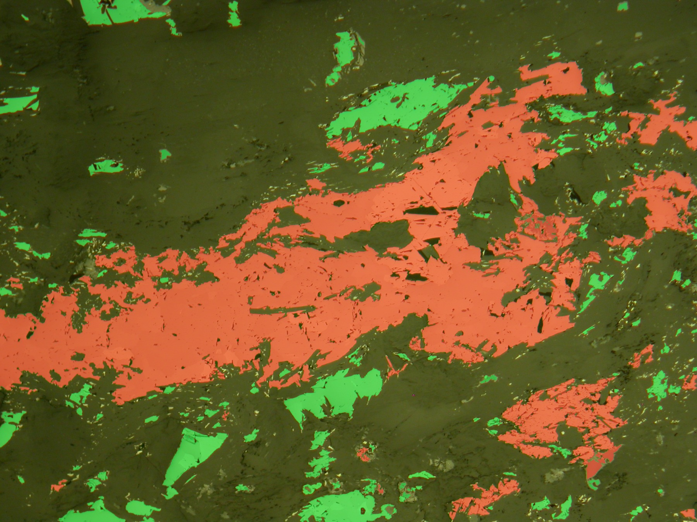
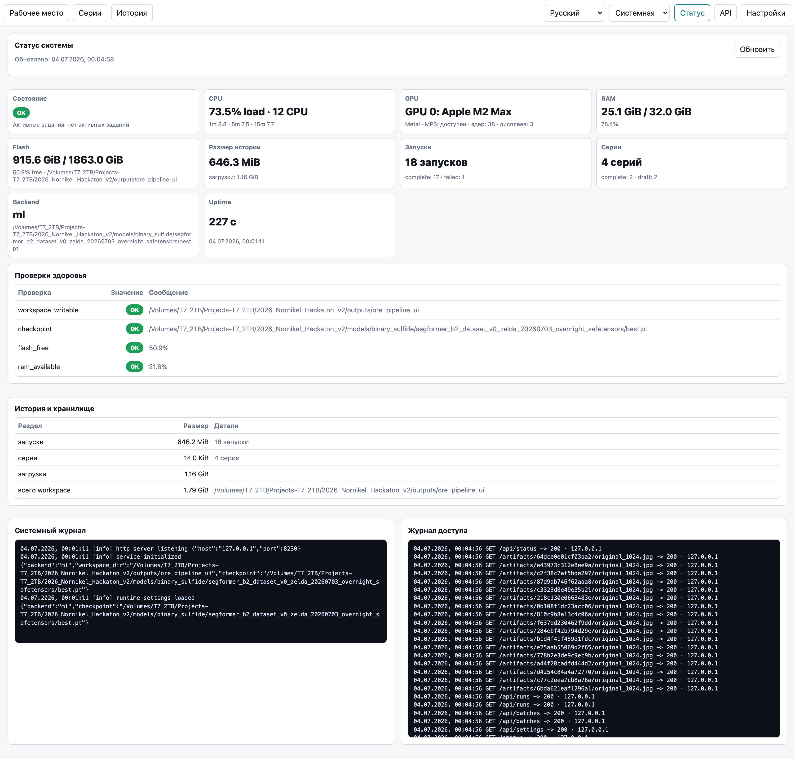
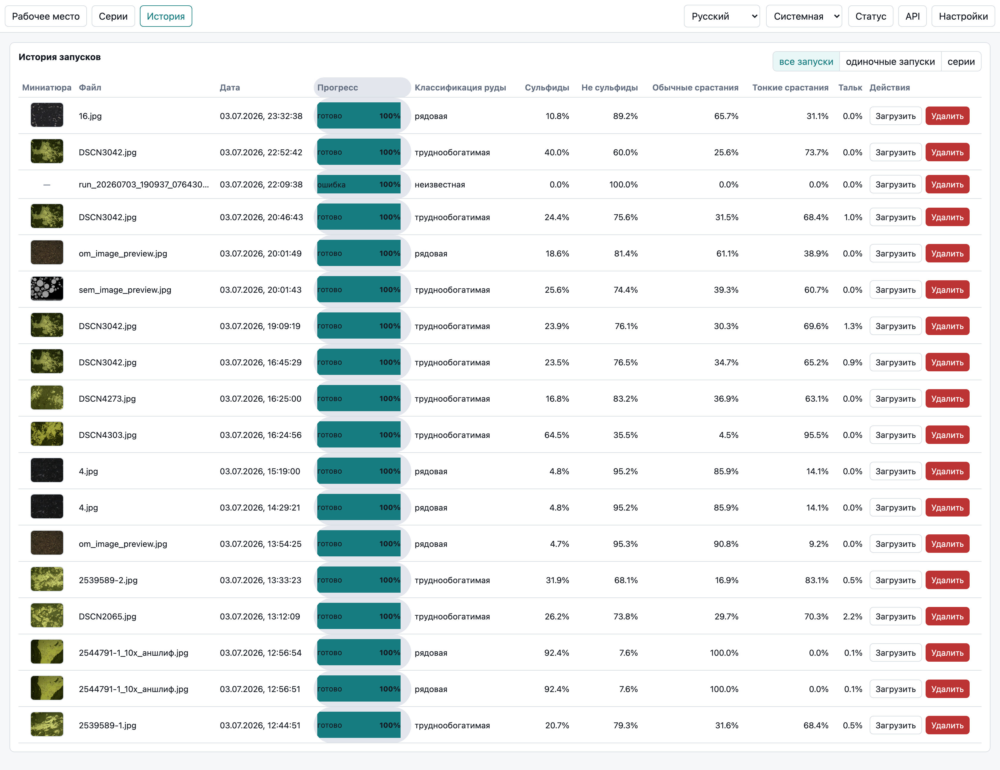

<span class="kicker">Норникель · AI Hackathon · Задача 3</span>

# Скажи мне, кто твой шлиф

## Интерпретируемый классификатор руды по панорамным OM-изображениям полированных шлифов

<div class="cols c2-60" markdown="1">

<div markdown="1">
Мы превращаем микрофотографию шлифа в измеримые доли фаз и **воспроизводимый тип руды** — с маской, которую геолог может проверить глазами.

<span class="chip ordinary">обычные срастания</span>
<span class="chip fine">тонкие срастания</span>
<span class="chip talc">тальк</span>

<span class="pill">optical microscopy only</span> <span class="pill">weak supervision</span> <span class="pill">SegFormer-B2</span>
</div>

<figure class="frame">

<figcaption>Главное приложение: цветная маска классов и заключение по руде</figcaption>
</figure>

</div>

*Легенда формата: заголовок → текст слайда → в конце курсивом — идея слайда для спикера. Слайды 1–18 — основной показ, дальше приложение с источниками. Один тезис на входе: не «ещё одна сегментация», а измерительный контур с проверяемым результатом.*

---

## <span class="num">1.</span> Задача и почему она трудная

Нужно по панорамному OM-изображению полированного шлифа:

- найти **сульфидные включения** (светлая рудная фаза);
- разделить их на **обычные** и **тонкие** срастания по степени замещения нерудной фазой;
- найти **тальк** в нерудной матрице и посчитать его долю;
- применить **экспертное правило** и выдать тип руды;
- показать маску, проценты и текстовое заключение.

Почему это болит сегодня:

- **субъективность** — разные специалисты по-разному читают характер срастаний;
- **трудоёмкость** — ручная сегментация гигапиксельной панорамы занимает часы;
- **масштаб** — десятки и сотни шлифов превращают анализ в «бутылочное горлышко»;
- **вариативность** — освещение, контраст, артефакты шлифовки ломают жёсткие пороги.

*Идея: сразу задать рамку — это прикладная технологическая классификация руды, а не абстрактная CV-метрика. Классы обычные/тонкие — это про морфологию замещения, а не про цвет пикселя; это объясняет всю нашу архитектуру.*

---

## <span class="num">2.</span> Наш принцип — не чёрный ящик, а проверяемый контур

Мы сознательно **не** строим один сквозной `изображение → класс`. Официальные данные дают сильный сигнал, но не дают полной попиксельной экспертной разметки.

Поэтому задача разложена на этапы, каждый из которых проверяем отдельно:

```text
панорамное OM-изображение
-> бинарная сегментация: сульфид / не сульфид
-> связные компоненты сульфидов
-> обычные / тонкие срастания по морфологии
-> отдельный детектор талька в матрице
-> детерминированное правило класса руды
-> маска, проценты, confidence, отчёт
```

Так геолог проверяет **не только итог, но и причину итога**: где рудная фаза, какое срастание у конкретного включения, где тальк, как посчитан процент.

*Идея: это главный дифференциатор для жюри. Разбиение на этапы = интерпретируемость + честность + возможность калибровать и мерить каждый шаг. LLM в финальном решении нет — правило детерминированное.*

---

## <span class="num">3.</span> Данные: что нам дали и что этого честно значит

<div class="cols c2 " markdown="1">

<div markdown="1">
**Официальный пакет Норникеля** (1236 файлов, ~3.0 ГБ, SHA-256 сверен):

- **1180 изображений с метками уровня папки** (не пиксельные маски):
  - рядовые (обычные) — **565**
  - тонкие / труднообогатимые — **486**
  - оталькованные — **129**
- **14 панорам**, крупнейшая ≈ **27025 × 21227 px**, без разметки и класса;
- **42 «Области оталькования»** — тальк, обведённый **синей линией** от руки (примеры, не сплошная разметка).
</div>

<div markdown="1">
**LumenStone S1/S2** — публичные полированные шлифы с **пиксельными масками минералов**:

- единственный реальный источник **пиксельной** разметки сульфидов;
- **S2** близок к Норильску (пирротин, халькопирит, пентландит, магнетит);
- используем как **proxy-претрен**, а не как официальную истину.

<div class="callout info" markdown="1">
**Честно:** официальная разметка — только метки папок + 42 примера синих линий. Пиксельной экспертной GT нет. Поэтому вся тренировка — слабый надзор, а метрики размечены по источнику.
</div>
</div>

</div>

*Идея: слайд данных обязателен для жюри. Ключевая честность: image-level метки + 42 примера + LumenStone-proxy. Мы не выдаём псевдоразметку за экспертную истину — это повторяется во всех метриках.*

---

## <span class="num">4.</span> Как и почему мы обучаем модели

**Почему сначала бинарная сульфидная модель, а не сразу 4 класса?**
«Обычные» и «тонкие» — это **морфология** включения, а не цвет пикселя. Самый корректно поставленный и лучше всего размеченный вопрос: *«где сульфидные пиксели?»*. Тип срастания считается уже потом — по связным компонентам.

**Почему слабый надзор?** Геолога нет, пиксельной GT нет. Мы собираем сигнал из независимых слабых источников и честно разделяем уверенность:

```text
LumenStone (реальные пиксельные маски)  -> претрен сульфид / не сульфид
яркостно-морфологический Otsu на官方 фото -> псевдо-метки в домене задачи
зоны согласия источников                 -> обучающая метка
зоны разногласий / границы               -> ignore (исключены из loss)
```

Разногласие источников **не** превращается в жёсткую метку — оно уходит в `ignore` и в QA. Тальк — **отдельная** задача в нерудной матрице (тальк — силикат, но большинство силикатов — не тальк).

*Идея: объяснить методологию простыми словами. «Бинарная сначала» + «agreement/ignore» + «тальк отдельно» — три решения, из которых вытекает всё остальное. Подчёркиваем: ignore-зоны — это про честность, а не про слабость.*

---

## <span class="num">5.</span> Сульфидная модель: SegFormer-B2 на слабых метках

<div class="cols c2-60" markdown="1">

<div markdown="1">
- Архитектура: **SegFormer-B2**, backbone **предобучен на ImageNet** (`nvidia/mit-b2`) и дообучен на наших метках; ResUNet — baseline «с нуля» для разнообразия.
- Тайлинг **512 px, шаг 384** (перекрытие 128) — панорама не ресайзится.
- Loss `CrossEntropyLoss(ignore_index)` — спорные пиксели не штрафуются.
- Аугментации: флипы, повороты 90°, мягкий color-jitter.
- Датасет `binary_sulfide_dataset_v0`: **8536 тайлов** (2976 LumenStone + 5560 официальных псевдо-метка).
</div>

<figure class="frame">

<figcaption>Слой «сульфиды»: результат первого этапа — бинарная маска</figcaption>
</figure>

</div>

| Модель | Инициализация | Val IoU сульфидов | F1 | AUC | HD95, px |
| --- | --- | ---: | ---: | ---: | ---: |
| **SegFormer-B2** (по умолч.) | ImageNet MiT-B2 | **0.9744** | 0.9870 | 0.9988 | 23.6 |
| SegFormer-B1 | ImageNet MiT-B1 | 0.9715 | 0.9856 | 0.9985 | 26.3 |
| ResUNet (base 32) | с нуля | 0.9564 | 0.9777 | 0.9969 | 37.4 |
| SegFormer-B0 | ImageNet MiT-B0 | 0.9534 | 0.9761 | 0.9962 | 33.9 |

<div class="callout" markdown="1">
**Оговорка честности:** это **weak-label** метрики на псевдо-разметке, а не экспертная геологическая точность. Часть валидации совпадает с той же Otsu-эвристикой, что породила метки, поэтому число завышено. Это критерий выбора чекпойнта, а не итоговая точность.
</div>

*Идея: показать, что модель реальная и сильная, но сразу отделить weak-label число от production-точности (требование организаторов — не гнаться за 100% на данных). B2 дообучен с ImageNet-претрена — это факт из console.log, не «с нуля».*

---

## <span class="num">6.</span> Срастания: не цвет пикселя, а форма зерна

Каждое сульфидное включение классифицируется по **морфологии восстановленного зерна**, а не по яркости:

- площадь компоненты;
- доля тёмной нерудной фазы внутри восстановленного контура (**replacement ratio**);
- сплошность (solidity) и компактность;
- сложность границы и фрагментация.

```text
крупное, компактное, слабо замещённое  -> обычное срастание (рядовая руда)
ажурное, фрагментированное, замещённое -> тонкое срастание (труднообогатимая)
```

> **Наше преимущество — классификация на уровне зерна, а не всего кадра.** Обычный
> image-level CNN отвечает на вопрос *«какой сорт у всего снимка?»* — одна метка на
> изображение, характер срастаний «зашит» неявно. Наш компонентный анализ отвечает
> на вопрос *«какой тип у каждого срастания?»* — **покомпонентно** размечает каждое
> включение как `обычное / тонкое` (`ordinary_intergrowth` / `fine_intergrowth`) и
> лишь затем агрегирует в доли и признаки. Это **настоящая классификация типа
> срастаний**, а не holistic-ярлык: геолог видит, какое именно зерно и почему
> повлияло на сорт.

<div class="cols c2" markdown="1">

<figure class="frame">

<figcaption>Покомпонентная разметка обычные/тонкие</figcaption>
</figure>

<div markdown="1">
Пороги морфологии **калибруются** по официальным папкам с метками уровня изображения (рядовые / тонкие), а не берутся «на глаз». Решение объяснимо: система может показать топ-компонент, который повлиял на класс.
</div>

</div>

*Идея: это геологическое ядро задачи. Ключевая мысль — «обычные/тонкие» = степень замещения нерудной фазой, что мы и меряем морфологией компонент, а не порогом яркости.*

---

## <span class="num">7.</span> Тальк: отдельная задача и отдельный детектор

Тальк ищется **только в нерудной матрице**: `анализируемая область − сульфиды − артефакты`.

Официальная разметка талька — **синие линии** на 42 фото. Мы превращаем их в обучающий сигнал:

- выделяем синий штрих по цвету → замыкаем контур → заполняем область → кандидат-маска;
- **исключаем пиксели самой разметки** (штрих идёт в ignore), чтобы модель не училась на маркере;
- переносим маску на **чистый оригинал** (парный файл по имени), а не на изображение с линиями.

Затем обучаем **отдельный** сегментатор талька (SegFormer-B0, non-sulfide-clipped):

<div class="stats">
<div class="stat talc"><div class="v">0.644</div><div class="k">talc IoU, 5-fold (silver)</div></div>
<div class="stat talc"><div class="v">0.782</div><div class="k">talc F1, 5-fold</div></div>
<div class="stat accent"><div class="v">0.502</div><div class="k">oracle-luma baseline (побит)</div></div>
<div class="stat fine"><div class="v">0.000</div><div class="k">старый HSV-кандидат (заменён)</div></div>
</div>

<div class="callout" markdown="1">
**Честно:** это **silver-маски** (не эксперт), а ревью велось с подсказкой по яркости — есть частичная цикличность, и все 42 фото делят условия съёмки. IoU 0.644 — против silver-масок, не против экспертной GT.
</div>

*Идея: тальк — самый хрупкий источник (нет внешних данных, ±3% меряется ровно на этих 42 фото). Показать, что мы (а) не учимся на маркере, (б) перешли от сломанного HSV (IoU 0) к обученной модели, (в) честны про silver-GT.*

---

## <span class="num">8.</span> Правило класса руды — детерминированное, из ТЗ

Финальная классификация не спрятана в модель и не зависит от LLM:

```text
если доля талька > 10%:
    оталькованная руда
иначе если обычные срастания >= тонкие:
    рядовая руда
иначе:
    труднообогатимая руда
```

Граничные случаи фиксируются явно и попадают в предупреждения:

- ровно 10% талька — **ещё не** оталькованная (строго `>`);
- 50/50 обычных и тонких → рядовая + флаг «на экспертную проверку»;
- ноль сульфидов и зоны артефактов исключаются из знаменателя.

Каждый процент прослеживается до маски, источника сигнала и параметров запуска.

*Идея: правило дословно из постановки задачи. Детерминизм = воспроизводимость и объяснимость. Decision margin (близость к порогу) — задел под режим «экспертной проверки».*

---

## <span class="num">9.</span> Большие панорамы: tiled-инференс

Панорамы до **27025 × 21227 px** не помещаются в память целиком, поэтому инференс потоковый:

```text
панорама
-> перекрывающиеся тайлы
-> батчевый инференс (GPU / CPU)
-> взвешенная сшивка (Hann) в memmap
-> глобальный connected-component postprocess
-> метрики и компоненты по всей панораме
```

Почему так:

- панорама **не ресайзится** — морфология зёрен сохраняется;
- перекрытие убирает швы на границах тайлов;
- глобальный проход склеивает включения, разрезанные тайлами;
- память укладывается в **T4-класс** GPU.

<div class="callout" markdown="1">
**Статус честно:** цель ТЗ — ≤ 5 минут на 10k×10k. Полный бенчмарк на панораме ещё впереди; замеренный end-to-end пока — **3.5 с на 2272×1704**.
</div>

*Идея: показать инженерную зрелость работы с гигапикселями и сразу честно отметить, что формальный 5-минутный бенчмарк на панораме — в списке ближайших задач.*

---

## <span class="num">10.</span> Приложение для ревью талька — `talc_review_web.py`

<div class="cols c2-60" markdown="1">

<div markdown="1">
Локальное браузерное canvas-приложение (stdlib `http.server`, без Streamlit). Роль — **QA и очистка слабой разметки**, а не движок инференса.

- парует фото с синими линиями и **чистый оригинал** по имени;
- строит первый кандидат-маску автоматически;
- инструменты: **кисть, заливка, «Similar», прямоугольник, полигон, SAM2-подсказка**;
- два класса — **Positive bag** и **Talc**, защита сульфидов, dark mode, undo/автосохранение;
- отрецензированные маски → `build_talc_dataset.py` → обучение детектора талька.

Все **42** образца прошли ревью (silver-GT).
</div>

<figure class="frame">

<figcaption>Ревью талька: очередь, холст с маской, метрики и классы</figcaption>
</figure>

</div>

Инструмент **«Similar»** (ядро на строке `apps/talc_review_web.py:2784`) при клике по зерну талька калибруется по **цветовой сигнатуре именно этого зерна**, а не по среднему всей области — иначе крупный «мешок» размывал бы выделение. Это делает интеллектуальное выделение похожих пикселей устойчивым.

*Идея: ответ на вопрос «что это за файл и что на строке 2784». Подчеркнуть: это инструмент производства обучающих масок (human-in-the-loop), а не инференс; строка 2784 — сердце устойчивости инструмента «Similar».*

---

## <span class="num">11.</span> Главное приложение — `ore_pipeline_web.py`

<div class="cols c2-60" markdown="1">

<div markdown="1">
Локальный браузерный UI всего пайплайна `изображение → маска → метрики → класс`. Русский интерфейс, immutable-запуски с провенансом.

- вкладки: **Рабочее место · Серии · История · Статус · API · Настройки**;
- интерактивный вьюер: слои **сульфиды / финал**, классы, тайлы, контуры, прозрачность, сравнение side-by-side;
- **правка маски и пересчёт** (edit-and-recalculate) как новый запуск;
- экспорт: **PDF-отчёт, metrics.csv, ZIP**;
- **Серии** (пакетная обработка), метаданные, калиброванный масштаб, маска артефактов.
</div>

<figure class="frame">

<figcaption>Рабочее место: вьюер, слои и текстовое заключение</figcaption>
</figure>

</div>

Пример заключения прямо в интерфейсе: *«Руда классифицирована как труднообогатимая: содержание талька — 0.0%, преобладание тонких срастаний — 73.7%»*.

*Идея: это то, что жюри увидит в демо. Показать, что это не «скрипт», а полноценный лабораторный инструмент с историей, экспортом и правкой. Money-shot — вьюер с маской и заключением.*

---

## <span class="num">12.</span> Инструмент работает как продукт, а не демо-скрипт

<div class="cols c2" markdown="1">

<figure class="frame">

<figcaption>Статус: ресурсы, GPU, health-проверки, бэкенд и чекпойнт</figcaption>
</figure>

<figure class="frame">

<figcaption>История: immutable-запуски, прогресс, заключения, экспорт</figcaption>
</figure>

</div>

- **Статус**: CPU/RAM/Flash, GPU (NVIDIA и Apple Metal/MPS), health-проверки, бэкенд и путь к чекпойнту;
- **История**: живой прогресс/ETA, миниатюры, повторная загрузка, удаление;
- **Настройки**: переключение бэкенда **heuristic ⇄ ML** на лету + неразрушающая проверка чекпойнта `Test`;
- **REST API** со встроенными песочницами запросов.

*Идея: усилить «production-readiness». Два бэкенда (эвристика без torch как fallback + ML SegFormer), провенанс каждого запуска (runtime.json), health-мониторинг — это зрелость, редкая на хакатоне.*

---

## <span class="num">13.</span> Возможности решения

<div class="cols c3" markdown="1">

<div markdown="1">
**Анализ**
- бинарная сегментация сульфидов
- покомпонентные обычные/тонкие
- детектор талька в матрице
- детерминированное правило руды
- decision margin и предупреждения
</div>

<div markdown="1">
**Работа с изображением**
- TIFF/PNG/JPEG + RAW
- предобработка (свет, шум, контраст)
- аугментации для устойчивости
- tiled-инференс гигапикселей
- маска артефактов / исключений
</div>

<div markdown="1">
**Продукт и вывод**
- интерактивный вьюер + слои
- правка маски и пересчёт
- PDF / CSV / ZIP, Серии
- Статус, REST API, провенанс
- локальное развёртывание, Docker
</div>

</div>

Полный список — на отдельной странице возможностей (`features.html`).

*Идея: компактная витрина возможностей одним экраном; детали и формулировки для жюри — на отдельной features-странице (одностраничник в том же стиле).*

---

## <span class="num">14.</span> Метрики и честность

Мы разделяем метрики по типу источника, чтобы не завышать уверенность.

| Официальная цель | Текущий статус |
| --- | --- |
| Ошибка доли талька ≤ ±3 п.п. | сегментатор талька заменил сломанный HSV; сквозной ±3% ещё не измерен |
| F1 классификации ≥ 90% | proxy (ExtraTrees по признакам B2): **macro-F1 0.744 / AUC 0.880** — честно ниже цели |
| ≤ 5 мин на 10k×10k | замерено 3.5 с на 2272×1704; бенчмарк панорамы впереди |
| IoU + Hausdorff (сегм.) | сульфид: IoU 0.974 / HD95 23.6 px (weak-label) |
| F1 + AUC (классиф.) | proxy-классификатор + покомпонентные признаки |

Что мы **не** утверждаем: «экспертная попиксельная GT», «все маски исправлены экспертом», «XRD/SEM влияет на официальный score».

*Идея: это сильная, а не слабая позиция для исследовательского жюри. Мы показываем измеримый контур и честные разрывы до цели — это выглядит зрелее, чем «у нас всё 99%». Числа — из бенчмарков и ChangeLog, с оговорками по источнику.*

---

## <span class="num">15.</span> Воспроизводимость и развёртывание

- **Immutable-запуски**: каждый запуск — неизменяемая папка с `run.json` + `reports/runtime.json` (бэкенд, чекпойнт, устройство, тайлы, пороги);
- **провенанс** прослеживает любой процент до маски и параметров;
- **два бэкенда**: эвристика (без torch, fallback и объяснимый baseline) и ML (SegFormer-B2);
- **Docker-развёртывание** проверено на публичной VM (`:8080`) и на gx10 (`:8210`, `--gpus all`, `NVIDIA GB10`);
- **локальный запуск** для конфиденциальных геологических данных — без внешних сервисов.

```bash
python3 apps/ore_pipeline_web.py --host 127.0.0.1 --port 0
```

*Идея: закрыть требования ТЗ по интеграции, воспроизводимости и локальному развёртыванию. Подчеркнуть, что решение уже разворачивается в Docker на двух целях, включая ARM-GPU.*

---

## <span class="num">16.</span> Статус и что дальше

**Уже сделано:**

- бинарная сульфидная модель SegFormer-B2 (weak-label IoU 0.974) + fallback-эвристика;
- обученный сегментатор талька (5-fold IoU 0.644), все 42 маски отрецензированы;
- покомпонентные обычные/тонкие + детерминированное правило руды;
- **honest eval-harness** (`evaluate_official_pipeline.py`): leak-free 345-сплит, устойчивость к аугментации/препроцессингу;
- **путь B** — human-in-the-loop разметка зёрен + агрегация в сорт (каркас end-to-end);
- полноценный UI: вьюер, правка, отчёты, Серии, Статус, API, Docker.

**Ближайшие шаги:**

1. сквозной бенчмарк панорамы под цель ≤ 5 минут;
2. измерение ошибки доли талька ≤ ±3 п.п. на 42 парах;
3. поднять image-level F1 к цели 90% — две дорожки: **A** сквозной `efficientnet_b3`, **B** размеченные зёрна + агрегация;
4. карта разногласий и очередь активного дообучения.

*Идея: показать, что ядро уже работает end-to-end, а оставшиеся пункты — это измеримые задачи, а не открытые вопросы. Список ближайших шагов совпадает с внутренней картой улучшений.*

---

## <span class="num">17.</span> Путь B: сорт по зёрнам — human-in-the-loop

Сильнейший актив — сегментация сульфидов (IoU 0.97) — работает как **экстрактор зёрен**: каждое связное сульфидное зерно с его морфологией.

- **сегментация → зёрна**: 345 изображений → ~69k зёрен (bbox + признаки формы);
- **человек размечает зёрна** (`apps/grain_review_web.py`): обычное / тонкое / неясно, поверх эвристического пре-лейбла;
- **grain-классификатор** (табличный, GroupKFold по аншлифу) → **агрегация в сорт** (доля тонких, взвешенная по площади) ⊕ ветка талька;
- честная **leak-free** оценка на том же 345-сплите (`aggregate_grade_from_grains.py`).

<div class="callout" markdown="1">
Оталькованная сортом определяется **тальком**, а не сульфидными зёрнами — эта ветка берёт обученный talc-сегментатор, а не зёрна. Путь B закрывает 2 из 3 сортов зёрнами + тальк для третьего.
</div>

Ценность — **интерпретируемость**: «62% зёрен тонкие — вот они подсвечены». Дополняет путь A (сквозной `efficientnet_b3`), не заменяет его.

*Идея: наш ответ, играющий на сильную сторону — сегментацию. Классификатор сорта в лоб (путь A) даёт цифру; путь B даёт объяснимый геологу вердикт поверх нашей маски. Честно: полный выигрыш требует человеческих меток зёрен, каркас уже работает end-to-end.*

---

## <span class="num">18.</span> Финальный тезис

Мы строим **интерпретируемый измерительный контур**, а не демонстрацию ML ради ML.

Система переводит панораму шлифа в измеримые признаки — доля талька, доли обычных и тонких срастаний, зоны уверенности и сомнения — и применяет **официальное экспертное правило**, выдавая результат, который можно:

- **проверить глазами** (маска и оверлеи),
- **повторить командой** (immutable-запуски и провенанс),
- **встроить в лабораторный отчёт** (CSV, JSON, PDF, batch).

<div class="stats">
<div class="stat sulfide"><div class="v">0.974</div><div class="k">IoU сульфидов (weak-label)</div></div>
<div class="stat talc"><div class="v">0.644</div><div class="k">IoU талька (silver, 5-fold)</div></div>
<div class="stat accent"><div class="v">2</div><div class="k">приложения + Docker</div></div>
</div>

*Идея: финальный слайд-резюме. Три глагола — проверить, повторить, встроить — это то, что нужно лаборатории. Держать честную рамку до конца.*

---

<span class="kicker">Приложение</span>

## Источники внутри проекта

- `docs/official/Скажи мне кто твой шлиф.md` — постановка задачи;
- `docs/specs/official-tz-solution-map.ru.md` — карта требований;
- `docs/plans/25…27, 35` — планы классификатора, слабого надзора, талька;
- `docs/benchmarks/01_binary_sulfide_model_benchmark.md` — бенчмарк сульфидов;
- `docs/cards/*` — карты моделей, данных и запусков;
- `docs/notes/2026-07-03-pipeline-improvement-proposals.md` — карта улучшений.

*Идея: показать, что каждое число прослеживается до документа в репозитории. Это часть истории про воспроизводимость.*
